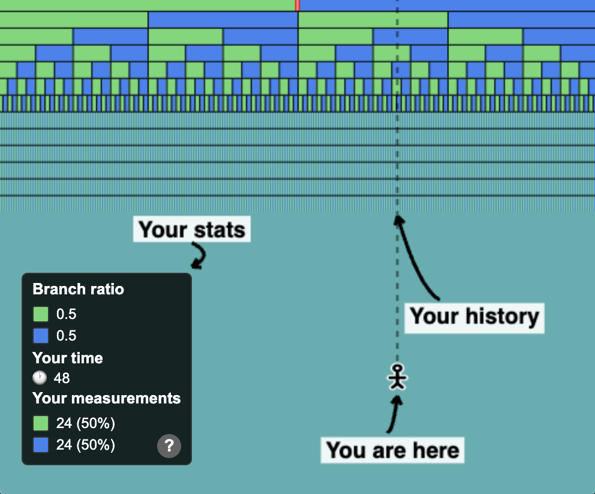

# Many Worlds Explorer

See [http://mw.identity.pub/](http://mw.identity.pub/).

Preview:

### Motivation

The [many-worlds interpretation of quantum mechanics](https://en.wikipedia.org/wiki/Many-worlds_interpretation) says that the universe is deterministic: i.e., it obeys [the Schrödinger equation](https://en.wikipedia.org/wiki/Schr%C3%B6dinger_equation).

So how do we end up with random numbers, for example with [quantum coin flips](https://en.wikipedia.org/wiki/Quantum_coin_flipping)? Well, to put it simply, many-worlds says that there's a world where you see heads and a world where you see tails, resulting in an illusion of randomness. This tool is a simulation to help develop an intuition for how this works.

The key takeaway is that, for almost every possible "you," the measured outcomes converge to 50% heads and 50% tails as you collect more samples. Try slowly dragging from the top to prove to yourself that it's actually counting correctly.

### What am I looking at?

- Cells represent worlds
- Each world branches into two worlds just below it:
    - A green world, representing heads
    - A blue world, representing tails
- You are `𖨆`. (Your cursor.)
- The vertical line is your past: it intersects with the sequence of coin flips you've measured
- "Your measurements" shows the counts and averages of the coin flips you've measured

### Advanced controls

| Press...               | To...                                  |
|------------------------|----------------------------------------|
| **Click and drag**     | Constrain yourself to one timeline     |
| **Drag the top row's center line**  | Adjust the branch ratio                |
| **↑**                  | See more time shown on-screen          |
| **↓**                  | See less time shown on-screen          |
| **→**                  | Add a new branch                       |
| **←**                  | Remove a branch                        |
| **&lt;space&gt;**      | Sort rows (shows conservation)         |